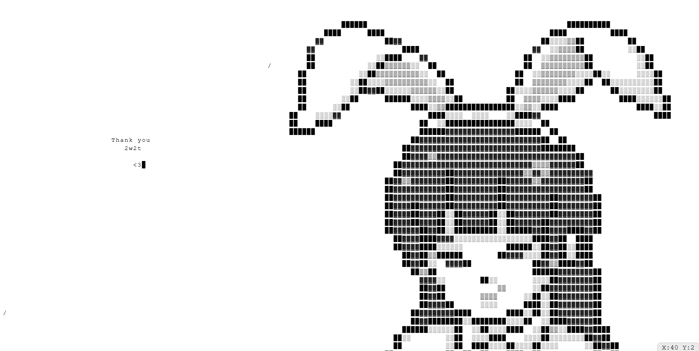

# 2w2t 

A fast, minimalist infinite canvas with a focus on instant chunk (canvas) rendering, smooth panning, and responsive real-time edits (a work in progress)

> **Note:** This repo contains **only the frontend**. To run it locally or deploy it, you’ll also need a compatible backend API + realtime hub (details below).

---

<p align="center">
  
</p>

# Design

 ---> 2w2t was built to feel instant on load and snappy during edits. The main tricks:

### Canvas-only rendering
No thousands of DOM nodes. Everything is drawn to a single `<canvas>`, which keeps layout/paint overhead tiny.

### Tile-based world + viewport fetching
The world is split into fixed-size tiles (`TILE_W × TILE_H` characters). On load and during pan/fling, the app fetches **only** the tiles in view (plus a small margin). This dramatically reduces network and memory cost.

### Optimistic local writes
Keystrokes update the local tile buffer immediately and render on the next frame. The network patch is sent in the background and reconciled by tile version.

### Batched / ordered patches
Keystrokes are queued so caret moves and patches stay in order. Contiguous runs can be sent as a single range patch (or single-cell patches, depending on your backend). This cuts round trips and avoids lost updates.

### Throttled viewport refresh + inertia
While panning, viewport tile fetches are throttled. On release, inertia/fling decays quickly; we only refetch when the visible tile range meaningfully changes.

### Tiny state, zero heavyweight libs
Plain React + TypeScript + a handful of small utilities. Most logic lives in `App.tsx`.

---

## Features

- Infinite text world with smooth pan/drag and inertia  
- Fast viewport-based tile loading  
- Optimistic typing with versioned conflict safety  
- Peer presence/typing indicators (simple “black rect” caret)  
- Keyboard & touch friendly  
- Minimal UI chrome, easy to theme/tune via constants  

---

# Project structure 

src/
```
App.tsx --> canvas renderer, viewport logic, input, networking glue
api.ts --> fetch tiles + send patches (REST)
signalr.ts --> realtime hub (SignalR)
types.ts --> Tile/TileKey, TILE_W/TILE_H/TILE_CHARS, helpers
App.css
```
  ---

## Backend requirements (you need this!)

This is the **frontend only**. To use it you must point it at a backend that exposes:

### REST (tiles)

**GET tiles by range**  
Returns an array of tiles within an inclusive rectangle.

```js
GET /tiles?minX=&maxX=&minY=&maxY=
-> [{ x, y, data, version }]
```
- `data` is a `TILE_CHARS`-length string (row-major characters)  
- `version` is a monotonically increasing integer

**PATCH tile** (style frontend expects)

Single-cell patch:
```js
PATCH /tiles/{x}/{y}
body: { offset: number, text: string (length 1), version: number }
-> { version: number }
```

Contiguous range patch (recommended for batching):
```js
PATCH /tiles/{x}/{y}/range
body: { start: number, text: string, version: number }
-> { version: number }
```


On version conflict, respond with **HTTP 409** and the latest version.

### Realtime (SignalR / WebSocket)

Join/Leave or Subscribe/Unsubscribe a tile’s live updates.

**Example invocations used by the app:**

- `JoinTile(x, y)` / `LeaveTile(x, y)` **or**  
- `Subscribe(x, y)` / `Unsubscribe(x, y)`

**Broadcasts:**
```js
tilePatched: { x, y, offset, text, version }
(optional) tileSnapshot: { x, y, data, version }
peerTyping: { x, y, col, row, sender }
```

The exact method names can be adjusted in `signalr.ts` to match your backend. The app already tolerates either JoinTile/LeaveTile or Subscribe/Unsubscribe patterns.


## Configuring the frontend to your backend

Create a `.env` (or `.env.local`) at the project root and point the app at your backend:

```bash
# Example (Vite-style)
VITE_API_BASE_URL=http://localhost:5000
VITE_SIGNALR_URL=http://localhost:5000/hub
```

Then, in `api.ts` / `signalr.ts`, read these env vars (or edit the hardcoded base URLs).
If you’re not using Vite, adapt to your bundler’s env system.

## Controls & UX

- Pan: click + drag (desktop) / touch drag (mobile)

- Inertia: release after a quick drag to fling; camera decays to stop

- Type: click to place caret, then type; Backspace clears previous cell

- Enter: moves to next line, keeping the starting column (“anchor”)

- Paste: pastes the first character of the clipboard (single glyph)

  ## Customization (in `App.tsx`)

  Tuning knobs (font size, paddings, zooms, fling physics):

```js
const FONT_PX = 14;
const PAD_X = 0.8;
const PAD_Y = 3;
const DEFAULT_ZOOM_X = 0.95;
const DEFAULT_ZOOM_Y = 0.94;
const FLING_SCALE = 0.6;
const DECAY_PER_MS = 0.007;
const MIN_SPEED = 0.00006;
const SAMPLE_MS = 180;
```
## Data integrity (how conflicts are avoided)

- Each tile carries a server version.

- The frontend applies edits locally (optimistic), then sends a patch with the last known version.

- If the server detects a mismatch, it should respond with 409 Conflict (plus the current version).

- The client will rebase or refetch the tile and retry, ensuring you never “roll back” server state.

## Deploying

- The frontend is a static site once built. You can serve dist/ on any static host (Vercel, Netlify, S3, static Nginx, etc.).

- Make sure the deployed site can reach your backend domain/port and that CORS is configured on the backend for the site’s origin.

- Set the correct environment variables for API base and hub URL.

## Credits
Inspired by YWOT (Your World of Text).
2w2t tries to be leaner and faster via canvas rendering (fast chunks, no loading menu), viewport-driven fetching, and optimistic/ordered updates. 

## Quick FAQ

Is this the full app?
No — this repo is frontend only.

What backend should I use?
Any server that matches the REST + realtime contract above. A typical stack is .NET + SignalR, Node + ws, or Go + Gorilla/WebSocket, as long as it exposes the same events and endpoints.

Why canvas instead of HTML?
Rendering thousands of characters as DOM nodes is slow. Canvas keeps layout/paint trivial, which is a big part of why 2w2t loads and scrolls much faster than classic YWOT UIs.

Where do I change the API URLs?
Set .env (`VITE_API_BASE_URL`, `VITE_SIGNALR_URL`) and/or edit `api.ts` / `signalr.ts`.

## License

MIT (see LICENSE).
